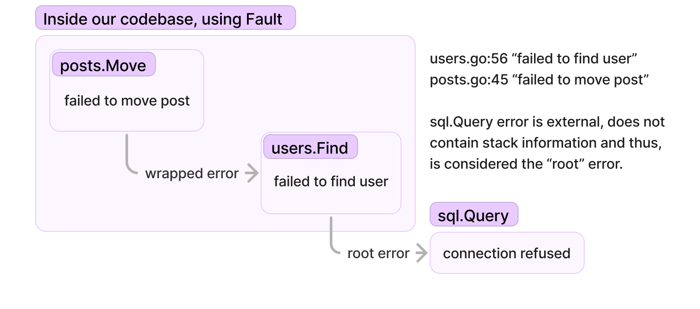
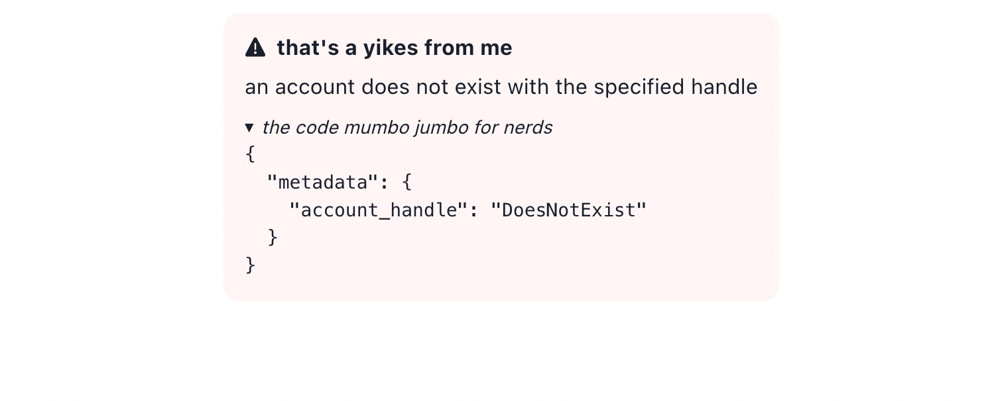
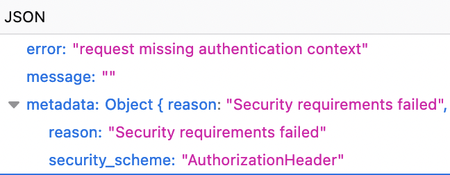
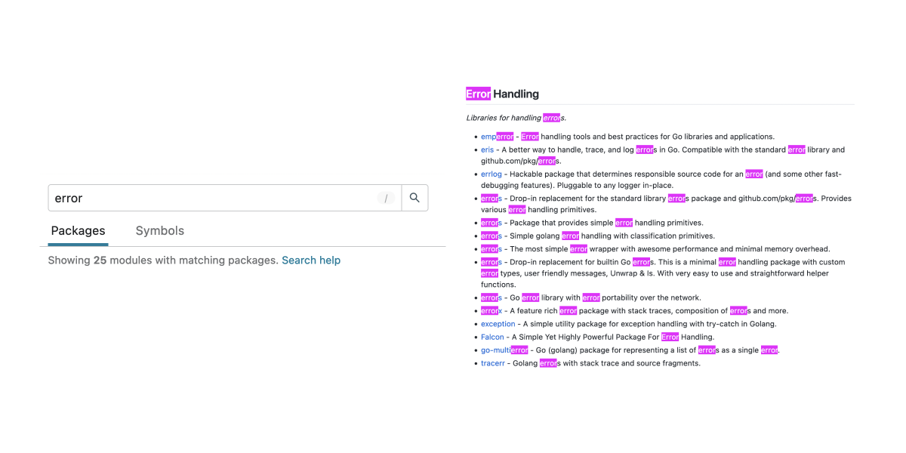

[](https://pkg.go.dev/github.com/Southclaws/fault?tab=doc)
[](https://goreportcard.com/report/github.com/Southclaws/fault)
[](https://codecov.io/gh/Southclaws/fault)

> Used in production at [Storyden](https://github.com/Southclaws/storyden) - an open source forum+wiki written in Go!

Fault provides an extensible yet ergonomic mechanism for wrapping errors. It implements this as a kind of middleware style pattern of simple functions called **decorators**: `func(error) error`. A decorator simply wraps an error within another error, much like many libraries do.

What this facilitates is a simple, minimal and (most important) _composable_ collection of error handling utilities designed to help you **diagnose problems** in your application logic without the need for overly verbose stack traces.

This is achieved by annotating errors with **structured** metadata instead of just gluing strings of text together. This approach plays nicely with structured logging tools as well as the existing Go errors ecosystem.

- [Usage](#usage)
  - [Wrapping errors](#wrapping-errors)
  - [Handling errors](#handling-errors)
- [Utilities](#utilities)
  - [`fmsg`](#fmsg)
  - [`fctx`](#fctx)
  - [`ftag`](#ftag)
- [Appendix](#appendix)

## Usage

You can gradually adopt Fault into your codebase as it plays nicely with the existing Go error management ecosystem.

### Wrapping errors

Wrapping errors as you ascend the call stack is essential to providing your team with adequate context when something goes wrong.

Simply wrap your errors as you would with any library:

```go
if err != nil {
    return fault.Wrap(err)
}
```

What this gives you is basic stack traces. The philosophy behind stack traces provided by Fault is that you only care about relevant code locations. You do not need `runtime/proc.go` in your stack traces unless you're actually working on the Go compiler or some crazy low level tooling. A fault stack trace looks like this when formatted with `%+v`:

```
stdlib sentinel error
    /Users/southclaws/Work/fault/fault_test.go:34
failed to call function
    /Users/southclaws/Work/fault/fault_test.go:43
    /Users/southclaws/Work/fault/fault_test.go:52
```

And of course all of this information is accessible in a structured way so you can serialise it how you want for your logging stack of choice. Fault aims to be unopinionated about presentation.

But what if you want to add context? With pkg/errors and similar libraries, you often use `errors.Wrap(err, "failed to do something")` to add a bit of context to a wrapped error.

Fault provides something much more powerful, a mechanism to compose many wrappers together. The `Wrap` API in Fault accepts any number of functions that wrap the error with the signature `func(error) error` so the possibilities are endless.

```go
if err != nil {
    return fault.Wrap(err, fmsg.With("failed to do a thing"))
}
```

This is how you add a message to an error in the same way you would with pkg/errors. Now this is quite verbose, lots of typing involved and if this is all you're going to do, you don't need to use Fault, you can just use `fmt.Errorf` and `%w`.

The power comes when you make use of some of the additional packages available as part of Fault:

```go
if err != nil {
    return fault.Wrap(err,
        fctx.With(ctx), // decorate the error with key-value metadata from context
        ftag.With(ftag.NotFound), // categorise the error as a "not found"
        fmsg.With("failed to do something", "There was a technical error while retrieving your account"), // provide an end-user message
    )
}
```

You can also build your own utilities that work with the Fault option pattern. This is covered later in this document.

### Handling errors

Wrapping errors is only half the story, eventually you'll need to actually
_handle_ the error (and no, `return err` is not "handling" an error, it's
saying "I don't know what to do! Caller, you deal with this!".)

Utilities will provide their own way of extracting information from an error but Fault provides the `Flatten` function which allows you to access a simple stack trace and a reference to the root cause error.

```go
chain := Flatten(err)
```

#### `chain.Root`

This is the root cause of the error chain. In other words, the error that was either created with `errors.New` (or similar) or some external error from another library not using Fault.

#### `chain.Errors`

This is the list of wrapped errors in the chain where the first item is the wrapper of the root cause.



## Utilities

Fault provides some utilities in subpackages to help you annotate and diagnose problems easily. Fault started its life as a single huge kitchen-sink style library but it quickly became quite bloated and developers rarely used everything it provided. This inspired the simple modular option-style design and each useful component was split into its own package.

It's worth noting that all of these utilities can be used on their own. If you don't want to use Fault's wrapping or stack traces you can simply import a library and use its `Wrap` function.

### `fmsg`



This simple utility gives you the ability to decorate error chains with a separate set of messages intended for both developers and end-users to read.

The error messages returned by `.Error()` are always intended for developers to read. They are rarely exposed to end-users. When they are, it's usually fairly confusing and not a great user-experience.

You can use `fmsg.With` (or `fmsg.Withf` if you need formatted string) to wrap an error with an extra string of text, just like pkg/errors and similar:

```go
extraContext := "extra context"
err := errors.New("root")
err = fault.Wrap(err, fmsg.With("one"))
err = fault.Wrap(err, fmsg.Withf("two (%s)", extraContext))
err = fault.Wrap(err, fmsg.With("three"))
fmt.Println(err)
// three: two (extra context): one: root
```

As with any simple error wrapping library, the `.Error()` function simply joins these messages together with `:`.

However, in order to provide useful end-user error descriptions, you can use `fmsg.WithDesc`:

```go
if err != nil {
    return fault.Wrap(err,
        fmsg.WithDesc("permission denied", "The post is not accessible from this account."),
    )
}
```

Once you're ready to render the human-readable errors to end-users, you simply call `GetIssue`:

```go
issues := GetIssue(err)
// "The post is not accessible from this account."
```

Multiple wrapped issues are conjoined with a single space. Issue messages should end in a punctuation mark such as a period.

```go
if err != nil {
    return fault.Wrap(err,
        fmsg.With("permission denied", "The category cannot be edited."),
    )
}

// later on

if err != nil {
    return fault.Wrap(err,
        fmsg.With("move post failed", "Could not move post to the specified category."),
    )
}
```

Yields:

```go
issues := GetIssue(err)
// "Could not move post to the specified category. The category cannot be edited."
```

Which, while it reads much nicer than `move post failed: permission denied`, both messages are valuable to their individual target audiences.

Further reading on the topic of human-friendly error messages in [this article](https://wix-ux.com/when-life-gives-you-lemons-write-better-error-messages-46c5223e1a2f).

### `fctx`



Error context is the missing link between the context package and errors. Contexts often contain bits of metadata about a call stack in large scale applications. Things like trace IDs, request IDs, user IDs, etc.

The problem is, once an error occurs and the stack starts to "unwind" (chained returns until the error is truly "handled" somewhere) the information stored in a context has already gone.

fctx gives you two tools to help understand the actual _context_ around a problem.

#### Add metadata to a context

First, you decorate contexts with key-value data. Strings only and no nesting for simplicity.

```go
ctx = fctx.WithMeta(ctx, "trace_id", traceID)
```

This stores the `traceID` value into the context. Conflicting keys will overwrite.

Note that while this function may look similar to `context.WithValue` in concept, it differs since it permits you to access _all_ of the key-value as a single object for iterating later. When using `context.WithValue` you must know the exact keys. Now you could store a map but in order to add items to that map you would need to first read the map out, check if it exists, insert your key-value data and write it back.

#### Decorate errors with context metadata

When something goes wrong, all that metadata stored in a context can be copied into an error.

```go
if err != nil {
    return fault.Wrap(err,
        fctx.With(ctx),
    )
}
```

#### Access metadata for logging

When your error chain is handled, you most likely want to log what happened. You can access key-value metadata from an error using `Unwrap`:

```go
ec := fctx.Unwrap(err)
logger.Error("http handler failed", ec)
```

The `Unwrap` function returns a simple `map[string]string` value which you can use with your favourite structured logging tool. Now, instead of your logs looking like this:

```json
{
  "error": "failed to create post 'My new post' in thread '1647152' by user '@southclaws' database connection refused"
}
```

Which is an absolute nightmare to search for when every error is worded differently...

They look like this:

```json
{
  "error": "failed to create post: database connection refused",
  "metadata": {
    "title": "My new post",
    "thread_id": "1647152",
    "user_id": "@southclaws"
  }
}
```

Which is an absolute godsend when things go wrong.

### `ftag`

This utility simply annotates an entire error chain with a single string. This facilitates categorising error chains with a simple token that allows mapping errors to response mechanisms such as HTTP status codes or gRPC status codes.

You can use the included error kinds which cover a wide variety of common categories of error or you can supply your own set of constants for your team/codebase.

```go
if err != nil {
    return fault.Wrap(err,
        ftag.With(ftag.NotFound),
    )
}
```

Once you've annotated an error chain, you can use it later to determine which HTTP status to respond with:

```go
ek := ftag.Get(err)
// ftag.NotFound = "NOT_FOUND"

switch ek {
  case ftag.NotFound:
    return http.StatusNotFound
  // others...
  default:
    return http.StatusInternalServerError
}
```

This removes the need to write verbose and explicit `errors.Is` checks on the error type to determine which type of HTTP status code to respond with.

Since the type `Kind` is just an alias to string, you can pass anything and switch on it.

## Appendix

### Rationale

The reason Fault came into existence was because I found nesting calls to various `Wrap` APIs was really awkward to write and read. The Golang errors ecosystem is diverse but unfortunately, composing together many small error related tools remains awkward due to the simple yet difficult to extend patterns set by the Golang standard library and popular error packages.

For example, to combine pkg/errors, tracerr and fctx you'd have to write:

```
fctx.Wrap(errors.Wrap(tracerr.Wrap(err), "failed to get user"), ctx)
```

Which is a bit of a nightmare to write (many nested calls) and a nightmare to read (not clear where the arguments start and end for each function). Because of this, it's not common to compose together libraries from the ecosystem.

### Prior art

Building on the shoulders of giants, as is the open source way. Here are some great libraries I goodartistscopygreatartistssteal'd from:

- https://github.com/rotisserie/eris
- https://github.com/cockroachdb/logtags
- https://github.com/cockroachdb/errors/tree/master/contexttags
- https://pkg.go.dev/google.golang.org/grpc/status

### Why "Fault"?

Because the word error is overused.


